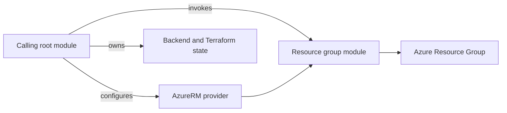

# Terraform Module for Azure Resource Group

Provisions an [Azure Resource Group](https://registry.terraform.io/providers/hashicorp/azurerm/latest/docs/resources/resource_group).
The caller owns the AzureRM provider configuration, backend, and Terraform
state.

## Dependency Graph



## Usage

```hcl
module "rg" {
  source              = "git::https://github.com/f2calv/tf_module_azurerm_resource_group.git//src?ref=0.2.1"
  resource_group_name = "my-resource-group"
  location            = "West Europe"
  tags                = { environment = "dev" }
}
```

<!-- markdownlint-disable MD060 -->
<!-- BEGIN_TF_DOCS -->
## Requirements

| Name | Version |
| ---- | ------- |
| terraform | >= 1.0 |
| azurerm | >= 5.0, < 6.0 |

## Providers

| Name | Version |
| ---- | ------- |
| azurerm | >= 5.0, < 6.0 |

## Resources

| Name | Type |
| ---- | ---- |
| [azurerm_resource_group.this](https://registry.terraform.io/providers/hashicorp/azurerm/latest/docs/resources/resource_group) | resource |

## Inputs

| Name | Description | Type | Default | Required |
| ---- | ----------- | ---- | ------- | :------: |
| resource\_group\_name | Name of the resource group. | `string` | n/a | yes |
| location | Location of the resource group. | `string` | `"West Europe"` | no |
| tags | Any tags that should be present on the resources. | `map(string)` | `{}` | no |

## Outputs

| Name | Description |
| ---- | ----------- |
| id | The ID of the resource group. |
| location | The location of the resource group. |
| name | The name of the resource group. |
<!-- END_TF_DOCS -->
<!-- markdownlint-enable MD060 -->

## Development

Regenerate the Terraform reference after changing resources, variables,
outputs, or version constraints:

```bash
terraform-docs --config .terraform-docs.yml src
```

The pre-commit configuration runs the same command in CI and fails when
generated documentation is not committed.
